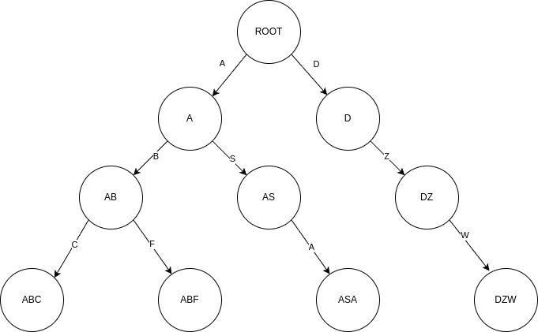
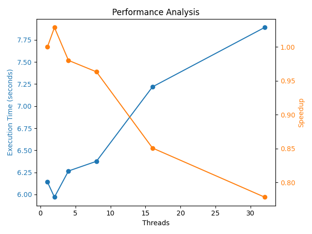

# Solução

## Otimização do algoritmo sequencial

Em primeiro lugar, observa-se que o algoritmo sequencial fornecido possui uma complexidade de $O(n^5)$. Para uma entrada de tamanho 30.000, é impossível paralelizar o código de forma que ele execute em um tempo realista. Dessa forma, o grupo compreendeu que era necessário pensar em um algoritmo sequencial mais rápido.

### Observação matemática importante

Analisando a definição do problema, uma constatação importante foi feita: para as combinações de A, apenas a entrada do registro de menor valor importa, uma vez que o valor desse registro é usado para filtrar a combinação e a ID desse registro é usada na construção de $ID'$.

De maneira semelhante, apenas o registro de maior valor importa para as combinações de B.

O que isso quer dizer? 

Se há um array `sorted_records_a` de tamanho $n$ com os registros ordenados pelo valor crescente do valor de A, se escolhemos o registro no índice i, temos dois casos:

1. Se `sorted_records_a[i].value` $\leq 0.25$, essa ID nunca estará em uma combinação válida de A.
2. Caso contrário, temos $n-max(i, beginA)$ combinações válidas com:
   -  ${ID}_{a_m}$ = `sorted_records_a[i].ID`
   -  ${a_m}$ = `sorted_records_a[i].value`
   -  beginA = primeiro índice tal que `sorted_records_a[beginA].ID` $> 0.25$

A mesma lógica se aplica para as combinações de B.

### Construção de um algoritmo $O(n^2)$ para gerar combinações $C_{AB}$

Usando o argumento anterior, conseguimos um algoritmo que gera as todas as combinações em $O(n^2)$:

    Para i em [0,N)
        Se vecA[i].value <= 0.25
            Continua
        Para j em [0,N)
            Se i == j ou vecB[j].value >= 0.75
                Continua
            ID' = combina(vecA[i].ID, vecB[j].ID)
            
O algoritmo pode ser otimizado (continua sendo quadrático), fazendo busca binária para saber o começo em A e o término em B:

    begin = lower_bound(vecA, 0.25+EPS)
    end = lower_bound(vecB, 0.75)
    Para i em [begin,N)
        Para j em [0,end)
            Se i == j
                Continua
            ID' = combina(vecA[i].ID, vecB[j].ID)

### Encontrando uma ID nos registros em O(1)

Agora, precisamos achar um método de procurar uma ID nos registros. O método trivial (percorrendo o array) é $O(n)$. Usando busca binária ou um set, podemos encontrar em $O(log(n))$. Porém, podemos fazer mais rápido. Com uma hash table ou uma árvore de prefixos (trie), essa busca pode ser feito em $O(1)$. Nesse projeto, optamos pela trie.

Em uma trie, cada nó representa um prefixo das entradas dessa árvore. As folhas da árvore representam as entradas guardadas. Por exemplo, na trie abaixo, guardamos as entradas ABC, ABF, ASA e DZW.



Na nossa implementação, guardamos o produto dos valores de A e de B na folha que representa determinada entrada. A construção da trie é feita antes do loop principal em $O(n)$.

Para sabermos se um ID existe no registro, basta percorrer a árvore. Caso uma folha é alcançada, o registro existe e temos seu produto. Caso uma determinada transição não exista, o registro também não existe. Essa busca é feita em $O(1)$.

### Algoritmo final em $O(n^2)$

Combinando as estratégias, chegamos no seguinte algoritmo:


    begin = lower_bound(vecA, 0.25+EPS)
    end = lower_bound(vecB, 0.75)
    Para i em [begin,N)
        Para j em [0,end)
            Se i == j
                Continua
            ID' = combina(vecA[i].ID, vecB[j].ID)

            ret, produto = busca(trie, ID')
            Se ret == 0
                Continua
            f = produto * vecA[i].value * vecB[j].value

            salva(vecA[i].ID, vecB[j].ID, ID', vecA[i].value, vecB[j].value, f)

### Entradas repetidas

De acordo com nossas observações sobre as combinaçõs de A e de B, quando escolhemos o elemento de A de indíce i e o elemento j de B, teríamos $(n-max(i,beginA)) \cdot min(j,endB)$ entradas repetidas.

Se fôssemos escrever todas as entradas repetidas, nosso output seria muito grande e, mesmo com paralelização, seria impossível computar em tempo hábil.

Por isso, escolhemos fazer o output com entradas únicas.

## Paralelização
            
Para paralelizar o algoritmo, usamos a diretiva `#pragma omp parallel for`, permitindo que múltiplas threads realizem as combinações.

### Escrita

Inicialmente, utilizamos `#pragma omp critical` para isolar a operação de escrita no arquivo. Porém, percebemos que assim as threads ficavam ociosas por muito tempo e a execução ficava drasticamente mais lenta com o aumento de threads.

Nossa solução foi deixar a escrita para o arquivo depois da computação das combinações. Para isso, criamos buffers separados para cada thread. Desse modo, uma thread escreve em seu respectivo buffer as combinações e, posteriormente, esses buffers são escritos sequencialmentes no arquivo de saída.

### Correção da função combine_ids

A implementação original dessa função usava uma variável estática, o que ocasionava um overhead e condições de corrida na chamada simultânea dessa função.

- Original
```c
char *combine_ids(const char *id1, const char *id2) {
    static char result[6];
    result[0] = id1[0];
    result[1] = id2[1];
    result[2] = id1[2];
    result[3] = id2[3];
    result[4] = id1[4];
    result[5] = '\0';
    return result;
}
```

- Corrigida (com cada thread fornecendo seu buffer)
```c
void combine_ids(const char *id1, const char *id2, char *result)
{
    result[0] = id1[0];
    result[1] = id2[1];
    result[2] = id1[2];
    result[3] = id2[3];
    result[4] = id1[4];
    result[5] = '\0';
}
```


## Resultados

Mesmo após as correções envolvendo buffers, observa-se que o algoritmo paralelizado ficou mais lento que o sequencial, conforme podemos ver no gráfico abaixo:



Anteriormente às correções, o aumento das threads ocasionava um aumento drástico do tempo de execução. Entretanto, após as correções, esse aumento é devido provavelmente ao overhead de sincronização e de criação de threads, que não conseguiu ser compensado pela paralelização.

Apesar disso, o algoritmo desenvolvido pela equipe mostrou-se rápido e eficiente, sendo capaz de realizar as operações em pouco mais de 6 segundos de maneira sequencial.
